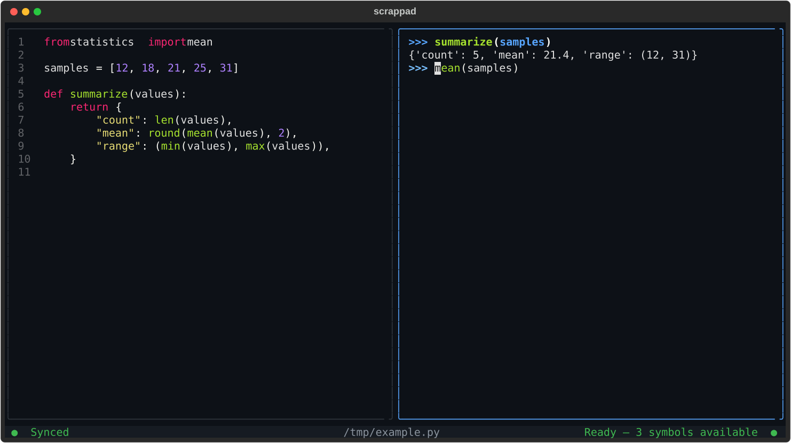

<div align="center">

# Scrappad

### Edit like a file. Explore like a REPL.

[](https://github.com/siliconlad/scrappad/actions/workflows/ci.yml)


[](LICENSE)

</div>

<p align="center">
  
</p>

## Quick Start

Install with [`uv`](https://docs.astral.sh/uv/):

```bash
uv tool install scrappad
scrappad
```

Or run without installing:

```bash
uvx scrappad
```

Pass a file to keep your work: `scrappad experiment.py`.

## Keyboard Shortcuts

| Shortcut | Action |
| --- | --- |
| `Ctrl+Left` / `Ctrl+Up` | Focus editor |
| `Ctrl+Right` / `Ctrl+Down` | Focus REPL and load changes |
| `Ctrl+C` | Interrupt running code |
| `Ctrl+S` | Save |
| `Ctrl+Q` | Quit |
| `Up` / `Down` | Browse REPL history |

## REPL Commands

| Command | Action |
| --- | --- |
| `:vars` | Show live names |
| `:sync` | Run editor |
| `:reset` | Reset state and run editor |
| `:clear` | Clear REPL output |
| `:help` | Show help |
